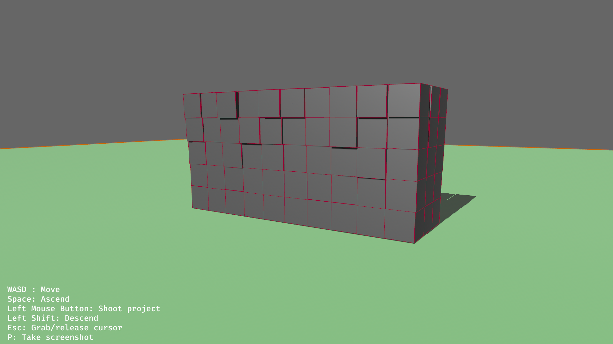
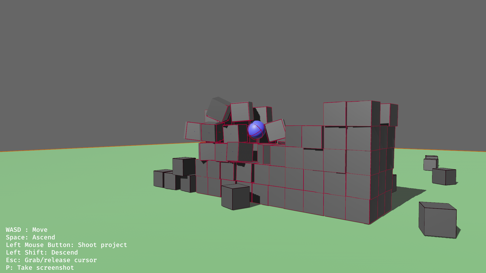
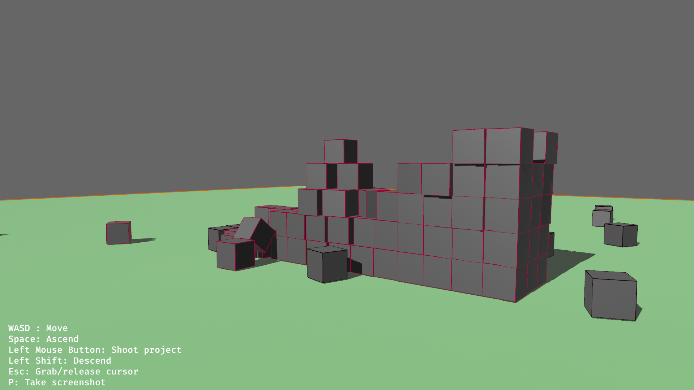

# Bevy Physics Playground

A physics playground demo app that I built while I was learning [Bevy](https://bevyengine.org/) and Rust. It uses the [Rapier library](https://rapier.rs/docs/user_guides/bevy_plugin/getting_started_bevy) for 3D physics on Bevy. The app starts with a wall made of cubes that you can destroy with projectiles.

## How to build and run
To build this project, you will need to have Rust and Cargo installed. You can install them from the [official website](https://www.rust-lang.org/tools/install).

If you are on Linux, you need to install the following dev dependencies:
```bash
sudo apt-get install --no-install-recommends libasound2-dev libudev-dev libgtk-3-dev
```

Once Rust and Cargo are installed, you can clone this repository and build the project with:
```bash
git clone https://github.com/caioteixeira/bevy_physics_playground.git
cd project
cargo build --release
```

You can just run the project with cargo as well
```bash
cargo run
```

## Controls
- WASD : Move
- Space: Ascend
- Left Mouse Button: Shoot project
- Left Shift: Descend
- Esc: Grab/release cursor
- P: Take screenshot

## Screenshots



